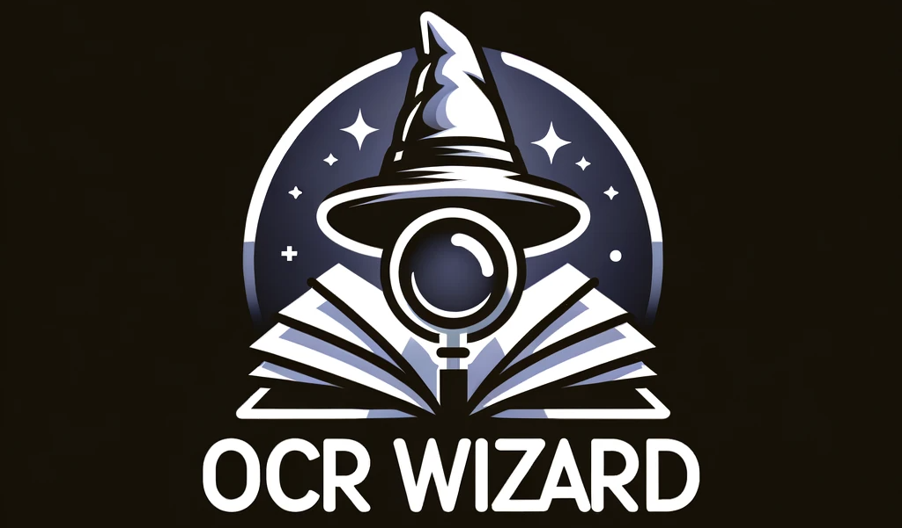

# Introduction
This project is a Django-based web application designed to streamline document processing by utilizing OCR (Optical Character Recognition) features.

1. **Installation process**
   - Clone the repository to your local machine.
   - Install [Tesseract](https://github.com/tesseract-ocr/tessdoc) 
   - Navigate to the project directory where the `manage.py` file is located.
   - Set up a virtual environment for Python and activate it.
   - Install the required dependencies using `pip install -r requirements.txt`.
   - Enter your TESSERACT_CMD_PATH in `ocr_reader.py`.

2. **Software dependencies**
   - This project requires Python 3.11.
   - All Python dependencies are listed in the `requirements.txt` file.

3. **Latest releases**
   - Keep an eye on the [GitHub repository](https://github.com/AivarasCer/final_project) for the latest releases.

